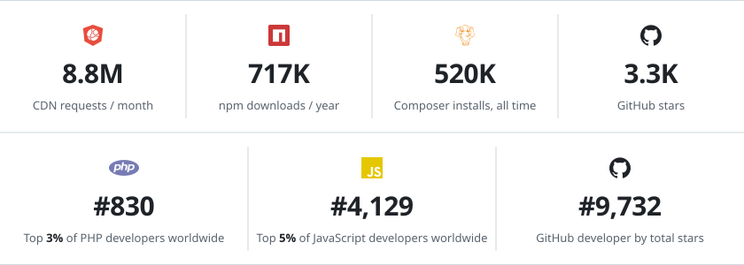

### Hi there 👋

I am Stefan Gabos, a web developer working from Bucharest, Romania. I'm half Hungarian, stubborn, articulate, and slightly afraid of women.

These days I also build fast, custom-coded one-page websites for small businesses at [PageDrop.pro](https://pagedrop.pro) - $297 once, no monthly fees.

<!-- stats: the images are regenerated weekly by .github/workflows/update-stats.yml -->
<a href="https://stefangabos.github.io/"><picture>
  <source media="(prefers-color-scheme: dark)" srcset="images/stats-dark.svg">
  
</picture></a>Usage from jsDelivr, npm, Packagist and GitHub. Rankings from <a href="https://profile.codersrank.io/user/stefangabos">CodersRank</a> and <a href="https://gitstar-ranking.com/stefangabos">Gitstar Ranking</a>. Refreshed weekly. All my libraries: <a href="https://stefangabos.github.io/">stefangabos.github.io</a>
<!-- /stats -->

 I started coding when I was around 14 (that's way back in 1994), and I am extremely passionate about it. I started coding in BASIC and then went on with Assembler and Turbo Pascal. In 1997 I started developing commercial applications using Microsoft Access. Since 2001 I'm developing exclusively for the web using PHP, MySQL, HTML, CSS and JavaScript.

I am an incurable workaholic and a perfectionist. I work with PHP, MySQL, HTML and CSS and JavaScript and have been using these things since back when GeoCities was the most visited website on the Internet and the `<blink>` tag was cool. I am among the 6 people in the world who were never afraid of Internet Explorer 6.

I develop rock-solid PHP libraries and super-lightweight, highly optimized, bad-ass jQuery plugins and open-source them because I am a web developer even when I'm not at work.

When working, I listen to massive amounts of music – alternative rock, in general. When I am not working (it sometimes happens), I enjoy playing the guitar, sleeping, cooking, watching Formula One or a good movie.

<!--
**stefangabos/stefangabos** is a ✨ _special_ ✨ repository because its `README.md` (this file) appears on your GitHub profile.

Here are some ideas to get you started:

- 🔭 I’m currently working on ...
- 🌱 I’m currently learning ...
- 👯 I’m looking to collaborate on ...
- 🤔 I’m looking for help with ...
- 💬 Ask me about ...
- 📫 How to reach me: ...
- 😄 Pronouns: ...
- ⚡ Fun fact: ...
-->
